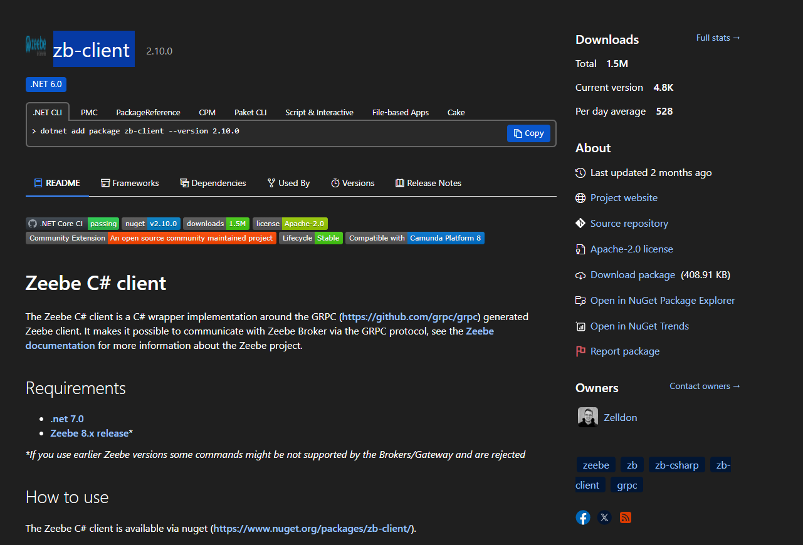
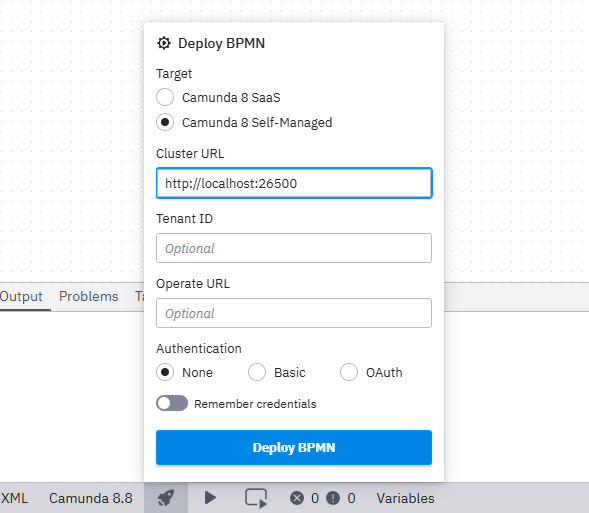
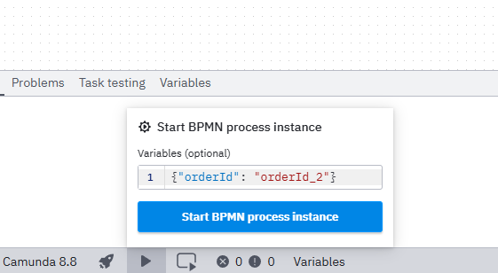

Library Usage
=================
- **zb-client**: This library provides a client for interacting with the Zeebe workflow engine, allowing you to create and manage workflows programmatically.


Installation and Usage Instructions for Camunda 8
===============================================
This document provides instructions on how to install and use Camunda 8
## Prerequisites
- **Docker**

## Installation Steps
1. **Download Camunda Modeler**
   - Download the latest version of Camunda Modeler from the [official website](https://camunda.com/download/modeler/).
   - Install Camunda Modeler on your machine.
2. **Clone Camunda 8 Run Repository**
   - Open a terminal or command prompt.
   - Clone the Camunda 8 Run repository using the following command:
	 ```bash
	 git clone https://github.com/le-minh-duc-dev/Camunda8_demo.git

   - Navigate to the cloned directory
3. **Run Camunda 8 Containers** 
	
   - Extract file docker-compose.yaml from docker-compose-8.8.zip [Latest file](https://docs.camunda.io/docs/self-managed/quickstart/developer-quickstart/docker-compose)
   - Open a terminal or command prompt.
   - Navigate to the directory where you extracted the `docker-compose.yaml` file.
   - Run the following command to start the Camunda 8 Run containers:
	 ```bash
	 docker-compose up -d
	 ```
4. **Run Service Workers**
	- Open the cloned repository folder in your terminal or command prompt.
	- Run the project by using favorite IDE (Visual Studio, Visual Studio Code, JetBrains Rider, etc..)
	 
5. **Open BPMN Modeler**
   - Launch the Camunda Modeler application installed in step 1.
   - Open file diagram_1.bpm in the cloned repository folder to start modeling your BPMN diagrams.
   - You can now start modeling your BPMN diagrams and deploy them to the Camunda 8 Run instance.
   - To deploy a BPMN diagram, click on the "Deploy Current Diagram" button in the Camunda Modeler and provide the necessary connection details (e.g., REST endpoint, authentication).

	

6. **Trigger Process Instances**
   - Using Camunda Modeler, you can trigger process instances of your deployed BPMN diagrams.
   - Click on the "Open start instance" button in the Camunda Modeler and provide the necessary details (e.g., process definition key, variables).
	
   
5. **Access Web Interfaces**
  - **Operate:** [http://localhost:8088/operate](http://localhost:8088/operate)
  - **Username:** `demo`
  - **Password:** `demo` 
